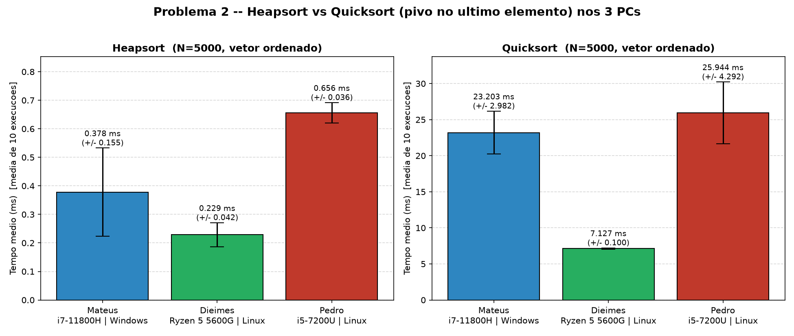
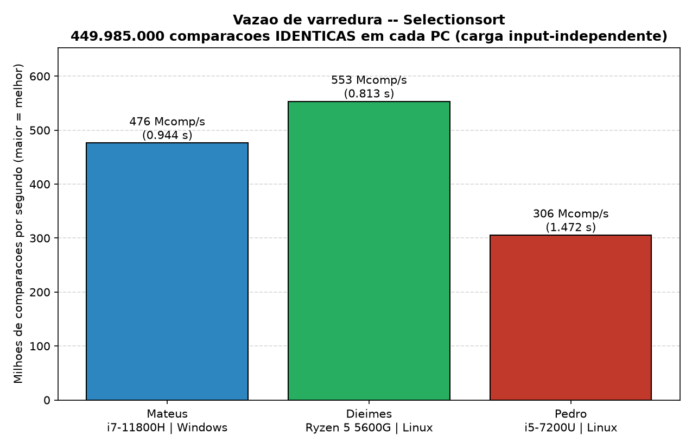

# Relatório Consolidado: Benchmarking e Análise Empírica de Algoritmos de Ordenação

### Estudo comparativo em 3 ambientes de hardware/sistema distintos

---

## 1. Identificação

| Integrante | RA | Máquina (apelido) | Sistema |
|---|---|---|---|
| Dieimes Nunes de Souza | 2848244 | **Dieimes** | Linux Mint 22.3 |
| Mateus da Silva Rego | 2864584 | **Mateus** | Windows 11 |
| Pedro Manoel Rosa Domingues Santos | 2627167 | **Pedro** | Ubuntu (Linux) |

- **Disciplina:** Estrutura de Dados, 1º Semestre / UTFPR
- **Linguagem:** C (mesmo código-fonte nas três máquinas)
- **Repositório:** https://github.com/mateuscmtropical/benchmarking-ordenacao

> Objetivo deste documento: unir os resultados executados independentemente nos
> três computadores do grupo e compará-los. Como o mesmo código foi compilado e
> rodado em três combinações diferentes de CPU, sistema operacional e compilador,
> os dados permitem não só responder às perguntas do enunciado, mas também
> observar o efeito da plataforma sobre o desempenho dos algoritmos.

---

## 2. Ambientes de Teste

| Item | Mateus | Dieimes | Pedro |
|---|---|---|---|
| **Processador** | Intel Core **i7-11800H** @ 2,30 GHz (8C/16T, 11ª ger., 2021) | AMD **Ryzen 5 5600G** (6C/12T, Zen 3, 2021) | Intel Core **i5-7200U** @ 2,50 GHz (2C/4T, 2016) |
| **Memória RAM** | 32 GB | 32 GB (31 GiB) | 18 GiB |
| **Sistema Operacional** | Windows 11 Home (10.0.26200) | Linux Mint 22.3 | Ubuntu (Linux) |
| **Compilador** | gcc 15.2.0 (MSYS2 / **MinGW-w64**) | gcc **13.3.0** | gcc **15.2.0** (Ubuntu) |
| **Biblioteca C (rand)** | msvcrt (Windows) | **glibc** (Linux) | **glibc** (Linux) |
| **Flags** | `-O2 -Wl,--stack,67108864 -lm` | `-O2 -lm` | `-O2 -lm` |
| **Pilha (Quicksort)** | `-Wl,--stack,64MB` (linker) | `ulimit -s unlimited` | `ulimit -s unlimited` |

### 2.1 Metodologia (idêntica nas três máquinas)

- Tempo medido com `clock_gettime(CLOCK_MONOTONIC)`, englobando apenas a chamada
  da função de ordenação.
- Cada algoritmo opera sobre uma cópia nova do mesmo vetor-base.
- Semente fixa `srand(42)` para reprodutibilidade.
- Contagem de operações: comparações = toda comparação de chaves; trocas = toda
  movimentação de elemento (cada swap conta 1; cada deslocamento de Insertion/Shell
  conta 1).

---

## 3. Validação: o mesmo código rodou nas três máquinas?

Sim, e os dados provam isso de forma objetiva. As contagens de comparações e
trocas são determinísticas: dependem só do algoritmo e do vetor de entrada, nunca
do hardware. Logo, qualquer entrada construída sem aleatoriedade deve produzir
contagens idênticas nas três máquinas. É exatamente o que ocorre:

| Entrada | Determinística? | Contagens nas 3 máquinas |
|---|---|---|
| Vetor ordenado (P1 melhor caso) | Sim | Idênticas (ex.: Bubble/Insertion 29.999 comp, 0 trocas) |
| Vetor inverso (P1 pior caso) | Sim | Idênticas (449.985.000 comp e trocas) |
| Vetor ordenado N=5000 (P2 inteiro) | Sim | Idênticas (ver §5) |
| Selectionsort (qualquer cenário) | Comparações independem da entrada | 449.985.000 comp em todas |
| Vetor aleatório (P1) | Não, usa `rand()` | Diferem entre Mateus e (Dieimes = Pedro) |
| Vetor quase-ordenado (P3) | Não, usa `rand()` | Diferem entre Mateus e (Dieimes = Pedro) |

### 3.1 Por que os cenários aleatórios divergem (e isso é esperado)

Nos cenários que usam `rand()`, as contagens de Mateus diferem das de Dieimes e
Pedro, mas Dieimes e Pedro são idênticas entre si. A causa é a biblioteca C:

- `srand(42)` + `rand()` produz sequências diferentes em implementações diferentes.
  O MinGW/Windows (Mateus) usa o gerador do `msvcrt`; o glibc/Linux (Dieimes e
  Pedro) usa outro gerador. Mesma semente, sequências pseudoaleatórias distintas,
  logo vetores de entrada distintos e contagens distintas.
- Dieimes e Pedro usam ambos glibc, logo mesma sequência e contagens
  byte-idênticas (ex.: Bubble aleatório = 449.897.368 comparações nos dois).

> Conclusão da validação: toda entrada determinística gera contagens idênticas nas
> 3 máquinas, logo o código é equivalente nas três. As únicas diferenças de
> contagem aparecem nos cenários aleatórios e são 100% explicadas pela troca de
> `rand()` entre Windows e Linux, não por diferença de implementação dos
> algoritmos. Como Dieimes e Pedro têm hardware diferente (Ryzen 5 vs i5) mas
> contagens iguais, confirma-se que são execuções independentes em PCs distintos
> sobre a mesma libc.

---

## 4. Problema 1: N = 30.000 (Bubble otimizado, Insertion e Selection)

### 4.1 Tempos de execução (s)

| Algoritmo | Cenário | Mateus | Dieimes | Pedro |
|---|---|---:|---:|---:|
| Bubblesort | Aleatório | 1,817428 | 1,613143 | 3,057235 |
| Bubblesort | Ordenado (melhor) | 0,000015 | 0,000030 | 0,000032 |
| Bubblesort | Inverso (pior) | 2,450625 | 2,564479 | 3,344253 |
| Insertionsort | Aleatório | 0,137092 | 0,103178 | 0,501518 |
| Insertionsort | Ordenado (melhor) | 0,000054 | 0,000027 | 0,000079 |
| Insertionsort | Inverso (pior) | 0,291188 | 0,205280 | 0,999695 |
| Selectionsort | Aleatório | 0,913152 | 0,813140 | 1,462329 |
| Selectionsort | Ordenado (melhor) | 0,932081 | 0,813375 | 1,482661 |
| Selectionsort | Inverso (pior) | 0,988081 | 0,812564 | 1,470478 |

_(dados brutos: `data_consolidado/{mateus,dieimes,pedro}/problema1.csv`)_

### 4.2 Contagens (comparações)

Comportamento qualitativo idêntico nas 3 máquinas; valores absolutos só divergem
no cenário aleatório (efeito `rand()` da §3):

| Algoritmo | Cenário | Mateus | Dieimes = Pedro |
|---|---|---:|---:|
| Bubblesort | Aleatório | 449.885.077 | 449.897.368 |
| Insertionsort | Aleatório | 225.551.463 | 225.697.282 |
| Selectionsort | Aleatório | **449.985.000** | **449.985.000** |
| _Todos_ | Ordenado | 29.999 / 29.999 / 449.985.000 | iguais |
| _Todos_ | Inverso | 449.985.000 | iguais |

Observações que valem nas três máquinas:
- Selectionsort faz 449.985.000 comparações (`n(n-1)/2`) em todos os cenários e em
  todas as máquinas; é insensível à ordem da entrada.
- Insertionsort aleatório faz cerca de metade das comparações do Selection
  (≈ 0,50×), confirmando seu caráter adaptativo.

### 4.3 Resposta à pergunta: Selection ou Insertion no vetor aleatório?

Em todas as três máquinas, o Insertionsort venceu o Selectionsort no vetor
aleatório:

| | Insertion | Selection | Vantagem do Insertion |
|---|---:|---:|---:|
| Mateus | 0,137 s | 0,913 s | 6,7× |
| Dieimes | 0,103 s | 0,813 s | 7,9× |
| Pedro | 0,502 s | 1,462 s | 2,9× |

A razão é a mesma nos três casos: o Selectionsort é não-adaptativo (sempre ~450
milhões de comparações, sem atalho), enquanto o Insertionsort é adaptativo, pois o
laço interno para (`break`) ao achar a posição da chave, gastando em média metade
das comparações. O resultado se sustenta independentemente da plataforma, o que
reforça que é uma propriedade do algoritmo, não do ambiente.

---

## 5. Problema 2: N = 5.000, vetor já ordenado (Heapsort × Quicksort)

Este é o experimento mais limpo para comparar máquinas: o vetor é construído sem
aleatoriedade, então as três máquinas processam exatamente o mesmo input e
executam exatamente o mesmo número de operações. Toda diferença de tempo é,
portanto, pura diferença de plataforma.

### 5.1 Contagens idênticas nas 3 máquinas (prova de equivalência)

| Algoritmo | Comparações | Trocas |
|---|---:|---:|
| Heapsort | **112.126** | **60.932** |
| Quicksort | **12.497.500** | **12.502.499** |

As 12.497.500 comparações do Quicksort equivalem exatamente a `n(n-1)/2` para
n = 5.000, a assinatura do pior caso O(n²), idêntica nos três PCs.

### 5.2 Tempos (média de 10 execuções ± desvio padrão)

| Máquina | Heapsort (s) | Quicksort (s) | Razão Quick/Heap |
|---|---:|---:|---:|
| **Dieimes** (Ryzen 5 5600G) | 0,000229 ± 0,000042 | **0,007127** ± 0,000100 | 31,1× |
| **Mateus** (i7-11800H) | 0,000378 ± 0,000155 | 0,023203 ± 0,002982 | 61,4× |
| **Pedro** (i5-7200U) | 0,000656 ± 0,000036 | 0,025944 ± 0,004292 | 39,5× |

_(dados: `data_consolidado/{maquina}/problema2_resumo.csv` e `..._execucoes.csv`)_



### 5.3 Resposta à pergunta: por que o Quicksort sofre e o Heapsort não?

Vale nos três ambientes. O Quicksort deste trabalho usa o último elemento como
pivô. Em vetor já ordenado, esse pivô é sempre o máximo do subvetor, e a partição
de Lomuto degenera em subvetores de tamanho `n−1` e `0`. A recorrência
`T(n) = T(n−1) + O(n)` resolve para O(n²), daí as 12,5 milhões de comparações. O
Heapsort é insensível à ordem (heap binário, O(n log n) garantido) e por isso fez
só 112.126 comparações em qualquer máquina. A degeneração é uma propriedade do
algoritmo somado à entrada, reproduzida identicamente nos três PCs (mesmas
contagens); o que muda entre eles é apenas a velocidade absoluta.

### 5.4 Leitura cruzada (o que o gráfico revela sobre as máquinas)

- O Dieimes (Ryzen 5 5600G) foi o mais rápido nos dois algoritmos, cerca de 3,3×
  mais rápido que o Mateus no Quicksort e 1,7× no Heapsort.
- O Pedro (i5-7200U) foi o mais lento, coerente com ser a CPU mais antiga e fraca
  (2 núcleos, 2016).
- O alto desvio do Heapsort no Mateus (±0,000155, ~41%) reflete o ruído de
  escalonamento do Windows: o Heapsort dura ~0,3 ms, perto da granularidade do
  relógio, e processos de fundo do SO inflam algumas execuções (ver
  `problema2_execucoes.csv`: tempos saltam de 0,20 ms para 0,53 ms no meio da
  série). O Dieimes/Linux foi muito mais estável.

---

## 6. Problema 3: N = 50.000, vetor quase-ordenado (Insertion × Shell)

Cenário: vetor ordenado com 0,5% dos elementos (250) trocados com o vizinho.

| Máquina | Insertion (s) | Shell (s) | Shell / Insertion |
|---|---:|---:|---:|
| Mateus | 0,000077 | 0,000790 | 10,3× |
| Dieimes | 0,000044 | 0,000650 | 14,8× |
| Pedro | 0,000126 | 0,002532 | 20,1× |

Contagens (Mateus usa libc diferente, logo 248 vs 250 trocas, ver §3):

| | Insertion comp | Shell comp | Trocas |
|---|---:|---:|---:|
| Mateus | 50.247 | 700.254 | 248 |
| Dieimes = Pedro | 50.249 | 700.256 | 250 |

_(dados: `data_consolidado/{maquina}/problema3.csv`)_

### 6.1 Resposta à pergunta: os "saltos longos" do Shell ajudam?

Não; nas três máquinas o Insertionsort venceu. O Insertion é adaptativo: com só
~250 inversões locais, cada elemento é comparado essencialmente uma vez e para
(`break`), resultando em ~50 mil comparações (quase-linear). O Shellsort paga um
custo fixo de ~16 passagens (`gaps` N/2, N/4, …, 1), cada uma varrendo todo o vetor
mesmo sem quase nada para mover, logo ~700 mil comparações de varredura
desperdiçada. Ambos fazem o mesmo número de trocas reais (248 a 250); a diferença
está nas comparações. Conclusão idêntica nos três ambientes: os saltos do Shell só
compensam sobre desordem de longo alcance, ausente aqui.

---

## 7. Análise Comparativa entre Máquinas

### 7.1 Métrica de vazão pura (a comparação mais rigorosa)

O Selectionsort faz 449.985.000 comparações idênticas em qualquer entrada e
qualquer máquina (carga input-independente). Dividindo esse total fixo pelo tempo
médio, obtém-se uma medida limpa de vazão da CPU/plataforma (milhões de
comparações por segundo; maior é melhor):

| Máquina | CPU | Tempo médio Selection (s) | **Vazão (Mcomp/s)** |
|---|---|---:|---:|
| **Dieimes** | Ryzen 5 5600G | 0,813 | **553** |
| **Mateus** | i7-11800H | 0,944 | **476** |
| **Pedro** | i5-7200U | 1,472 | **306** |



### 7.2 Ranking e interpretação

1. Pedro é consistentemente o mais lento em todos os experimentos (~1,8× mais
   lento que o Dieimes na vazão). Conclusão robusta e atribuível à CPU: o i5-7200U
   é um chip móvel de 2 núcleos de 2016, muito atrás das outras duas CPUs. Como
   Pedro e Dieimes usam a mesma plataforma de software (Linux/glibc), a diferença
   entre eles isola o efeito do hardware, e mostra o salto geracional Ryzen 5
   5600G (2021) vs i5-7200U (2016): de 1,8× a 3,6×.

2. Dieimes (Ryzen 5) e Mateus (i7) ficam próximos e trocam de posição conforme a
   carga. O Dieimes lidera na maioria (vazão de varredura, Quicksort recursivo,
   Heapsort), mas o Mateus foi ligeiramente mais rápido no cenário Bubble-inverso
   (2,451 s vs 2,564 s), que é dominado por escritas/swaps. Isso ilustra que o
   gargalo muda com o algoritmo: cargas de comparação/varredura favoreceram o
   Ryzen; a carga de swap massivo favoreceu o i7.

3. O caso mais marcante é o Quicksort (pior caso, fortemente recursivo): o Dieimes
   foi cerca de 3,3× mais rápido que o Mateus, gap muito maior que na vazão de
   varredura (~1,16×). A diferença não é só de CPU; é confundida com a plataforma
   de software, pois cada integrante usou uma combinação distinta de SO mais
   compilador (Linux/gcc nativo vs Windows/MinGW). Recursão profunda (5.000 níveis)
   é sensível a codegen e ao gerenciamento de pilha, e o toolchain Linux/gcc nativo
   levou clara vantagem aqui.

> Ressalva metodológica honesta: como CPU, SO e compilador variam juntos entre os
> integrantes, não é possível atribuir cada diferença de tempo a um único fator de
> forma isolada, exceto no par Pedro vs Dieimes, que compartilha Linux/glibc e
> isola a CPU. Por isso a análise trata "plataforma" (CPU mais SO mais compilador)
> como a unidade de comparação, e usa a vazão do Selection (§7.1) e as contagens
> determinísticas (§3, §5.1) como as evidências mais sólidas.

### 7.3 O que não depende da máquina (validações que casaram nos 3 PCs)

- Selection sempre `n(n-1)/2` comparações; Quicksort em vetor ordenado sempre
  `n(n-1)/2` (pior caso O(n²)); Insertion/Shell sempre 248 a 250 trocas no P3.
- Insertion sempre mais rápido que Selection (aleatório) e que Shell (quase-ord.).
- Quicksort sempre dezenas de vezes mais lento que Heapsort em vetor ordenado.

Ou seja: as conclusões algorítmicas do enunciado são reproduzíveis e independentes
de plataforma; a plataforma altera apenas as constantes de tempo, nunca a ordem de
grandeza ou o vencedor de cada comparação.

---

## 8. Conclusão

O estudo em três ambientes distintos fortalece as conclusões do trabalho: cada
resposta do enunciado (Insertion > Selection no aleatório; Quicksort degenera em
O(n²) no vetor ordenado enquanto o Heapsort não; Insertion > Shell no
quase-ordenado) foi reproduzida nas três máquinas, com contagens determinísticas
idênticas sempre que a entrada não era aleatória, prova objetiva de que o mesmo
algoritmo rodou em todos os PCs.

Sobre desempenho de hardware: Dieimes (Ryzen 5 5600G) > Mateus (i7-11800H) > Pedro
(i5-7200U) na vazão de comparações, com o Pedro claramente limitado pela CPU mais
antiga. As maiores diferenças (Quicksort recursivo) misturam efeito de CPU e de
toolchain (Linux/gcc nativo vs Windows/MinGW), que não são separáveis neste
conjunto, uma limitação metodológica reconhecida. As contagens de operações
mostraram-se a evidência mais estável e foram a espinha dorsal da análise.

---

## Apêndice A: estrutura dos dados consolidados

```
Atividade-ordenacao/
├── RELATORIO_CONSOLIDADO.md          (este documento)
├── grafico_consolidado.py            (gera os 2 gráficos abaixo a partir dos CSVs)
└── data_consolidado/
    ├── mateus/    problema1.csv, problema2_execucoes.csv, problema2_resumo.csv, problema3.csv
    ├── dieimes/   (mesmos 4 arquivos)
    ├── pedro/     (mesmos 4 arquivos)
    ├── grafico_p2_consolidado.png
    └── grafico_throughput_consolidado.png
```

Para regenerar os gráficos: `python grafico_consolidado.py`

## Apêndice B: observação sobre o `RELATORIO_Pedro.md`

O arquivo `RELATORIO_Pedro.md` foi derivado do template do Mateus e ficou com texto
desatualizado em parte: o cabeçalho ainda cita `MSYS2/MinGW-w64` (o ambiente real
do Pedro é Ubuntu) e as tabelas dos Problemas 2 e 3 exibem números do Mateus, não
os do Pedro. A fonte de verdade adotada neste consolidado são os arquivos CSV
(`data_consolidado/pedro/`), que contêm os tempos e contagens reais medidos na
máquina do Pedro. Recomenda-se corrigir o `RELATORIO_Pedro.md` individual antes da
entrega, se ele for entregue separadamente.
